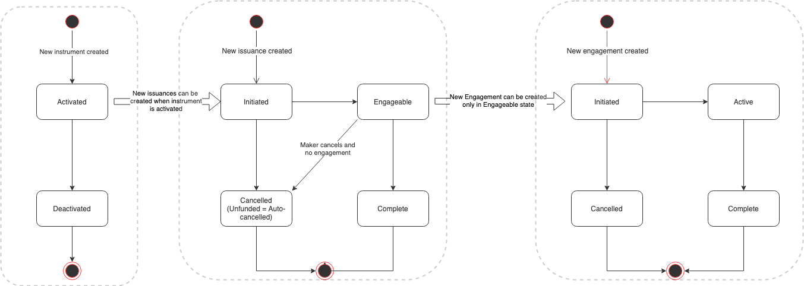

# Domain Model

This image below shows the complete lifecycle of instrument, issuance and engagement.

## Instrument Lifecycle

The left part of the image is the lifecycle of instruments. Instruments are activated on NUTS Platform by FSPs and defines a single asset domain.

Once an instrument is activated, makers can create new issuance based on the instrument. No new issuance is created once the instrument is deactivated.

There are two approaches to deactivate an instrument: manually and automatic. In activating a financial instrument, FSP could specify two parameters:

* Instrument override timestamp, which means when the FSP who activates the instrument can deactivate the instrument manually. If FSP wants to deactivate an instrument any time, they can simply specify a small value. Otherwise, if FSP wants no one to manually deactivate the instrument, they can specify an arbitrarily large value.
* Instrument termination timestamp, which means when the instrument is deactivated automatically. If FSP doesn't want the instrument to deactivate automatically, they can provide an arbitrarily large value.

In activating new instruments, FSP might be required to deposit certain NUTS token as part of the instrument activation process. The number of NUTS token to deposit is a global configuration parameter of NUTS Platform. When the instrument is deactivated, the deposit token, if there is any, will be burned.

## Issuance Lifecycle

The center part of the image is the lifecycle of issuance. When an instrument is activated, makers can create new issuances based on it. Once created, an issuance's lifecycle is independent of its instrument. When the instrument is deactivated, no one issuances can be created, but the existing issuance is not affected.

When an issuance is created, it is in Initiated state. An Initiated issuance is not qualified for engagement as makers might need to perform certain operations before it's engageable. Common operations include depositing collateral, or waiting for certain external condition to be met. Once those conditions are met, an issuance becomes Engageable and can be engaged by takers. An issuance can have one or more engagements, depending on instrument nature.

The maker who creates the issuance can cancel the issuance if the issuance is in Initiated state, or in Engageable state but there is no engagement. Once there is an engagement, any attempt to cancel this issuance will fail.

Each issuance can define its own lifespan. Once due, the issuance is transitioned into Complete state. An issuance cannot accept new engagement once it's in Complete state. It might also become Complete prematurely if certain conditions are met. For example, an issuance might expect no more than 5 engagements. Once it has accepted 5 engagements before it's due, it will go into Complete state. Each issuance has a parameter, named completion ratio whose range is 0 to 10000, to track the progress of an issuance. It's expected that a premature issuance should have a completion ratio of 10000, while an issuance completes when it's due should have a smaller completion ratio.

## Engagement Lifecycle  

The right part of the image is the lifecycle of engagements. Takers can engage in existing issuance if the issuance is in Engageable state. Once created, an engagement's lifecycle is independent of its issuance. An issuance does not accept new engagement once it's in Complete state, but the existing engagements are uneffected.

An engagement is in Initiated state once it's created. This allows taker to complete some operations before the engagement becomes Active. Takers cannot cancel an engagement once it's in Active state.

An engagement should eventually go to Complete state, but the process varies depending on the issuance nature.

