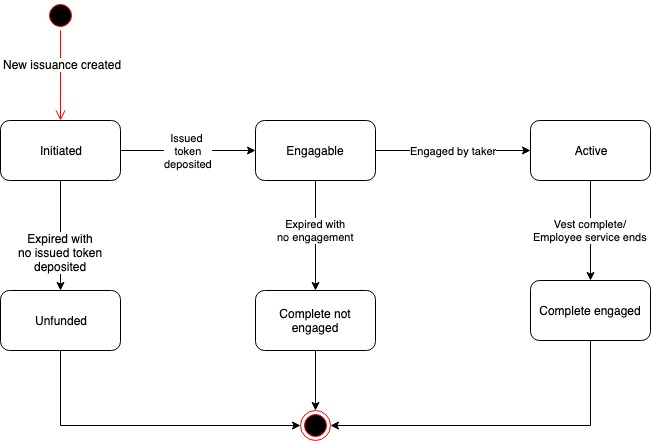

# ESOP Instrument

## Use Case Description

The system will allow makers to create new Employee Stock Option Plan \(ESOP\) issuances, and allow takers to engage existing ESOP issuance.

## Actors

* Maker, who is the asset seller of the ESOP issuance. Usually the Foundation who wants to incentivize employees;
* Taker, who is the asset purchaser of the ESOP issuance. Usually the Foundation employee;
* Timer Oracle, who is an external timer service provider that provides timing triggers to the NUTS Technology Platform.

## Precondition

* Financial Service Providers have created the ESOP instruments using the NUTS protocol;

## Process Flow

### Main Process Flow

* Maker creates new issuance of ESOP instrument;
* Maker deposits the issued token to the ESOP issuance;
* Taker engages the ESOP issuance;
* Maker vests issued tokens according to the vesting schedule. Taker can withdraw the issued token that is already vested;
* When the vesting schedule ends, the issuance becomes complete engaged;
* When the employee service ends before the vesting schedule due, the issuance becomes complete engaged.

### Alternative Process Flow

* If maker does not deposit the issued token in time, the issuance becomes unfunded;
* If there is no engagement in time, the issuance completes with no engagement.

## Issuance States

Below are the possible states of an ESOP contract:

* Initiated: The ESOP issuance is created;
* Engageable: The maker deposits the issued token;
* Active: The taker engages the ESOP issuance;
* Complete Engaged: The vesting schedule completes or the employee service ends;
* Unfunded: The maker fails to deposit the issued token in time;
* Complete not Engaged: No taker engages in time;

