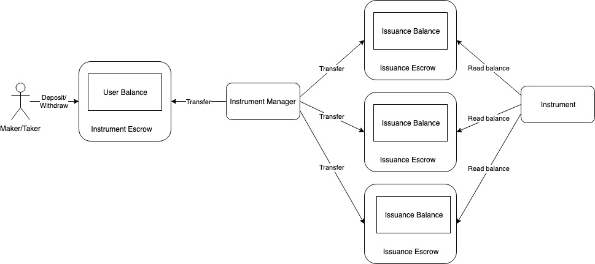

# Escrows

In NUTS Platform, each financial instrument domain represents a single asset domain. Assets from different instrument domains are separated from each other. 

In addition, users of NUTS Platform must explicitly deposit their assets into individual instrument domain in order to create or engage issuances in this domain. This guarantees that even if an instrument is broken, users' assets in their wallet or in other instrument domains are not affected.

Within each instrument domain, assets are hold by Escrows. Each instrument domain generally consists of two kinds of escrows:

* Instrument Escrow,  which serves as the asset portal of this instrument;
* Issuance Escrow, which manages assets for individual issuance.

All escrows are created by Escrow Factory and managed by Instrument Manager. The image below shows the relationship between Escrows and Instrument Manager in an instrument domain. When an asset needs to be transferred from Instrument Escrow to Issuance Escrow, Instrument Manager withdraws the asset from Instrument Escrow and then deposits it into Issuance Escrow. The flow is similar when transferring asset from Issuance Escrow to Instrument Escrow. Since Instrument Manager is the only admin of both Instrument Escrow and Issuance Escrow, it's the only party that could operate on the assets within an instrument domain.

The table below gives a comparison between Instrument Escrow and Issuance Escrow. They both support direct deposit and withdrawal by Instrument Manager, while Instrument Escrow also supports user deposits and withdrawals.

|  | Instrument Escrow | Issuance Escrow |
| :--- | :--- | :--- |
| Creation | Created when instrument domain is created | Created when issuance is created |
| Number | One per instrument domain | One per issuance |
| Access by user | Deposit/Withdraw from their own account | Read-only |
| Access by instrument manager | Deposit/Withdraw from any account | Deposit/Withdraw from any account |
| Access by issuance | Read-only | Read-only |

