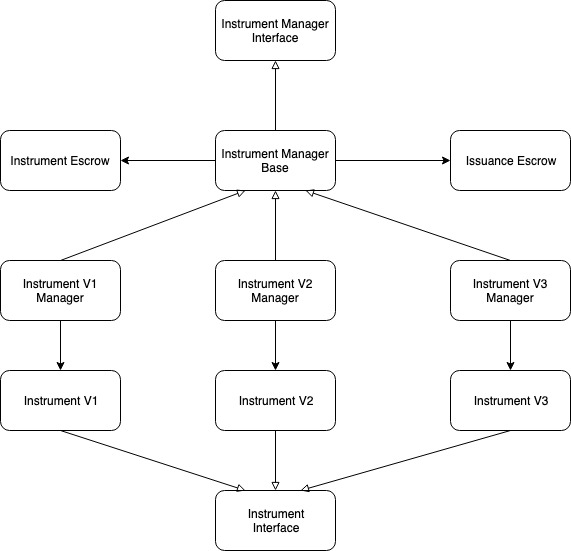

# Instrument Manager

Instrument Manager is the core of a financial instrument management domain. Its main functionalities include:

* Manages issuance assets using Issuance Escrows
* Manages issuance data using Issuance Storages
* Manages issuance lifecycle by delegating issuance operations to Instrument
* Controls access to Instruments
* Provides standardized Oracle services to Instrument

## Instrument Manager Domain Model

As NUTS Platform is targeted to become a general financial instrument platform, it should be able to support financial instrument with various complexity and requirements in security, flexibility, ease of development, and etc. Therefore, NUTS Platform has defined multiple Instrument Interface to model the financial instrument and serve as the interface between Instrument Manager and Instrument.

Currently NUTS Platform supports three Instrument Interface: Instrument Type I, Instrument Type II, and Instrument Type III. Correspondingly, NUTS Platform also provides three Instrument Manager implementation: Instrument Manager Type I, Instrument Manager Type II, and Instrument Manager Type III. Details about these Instrument Managers are discussed in following pages.

| Instrument Type | Type I | Type II | Type III |
| :--- | :--- | :--- | :--- |
| Asset Management | Same | Same | Same |
| Access Control | Same | Same | Same |
| Data Management | Treats issuance data as a single string | Stores issuance data in a storage contract | Stores issuance data in proxy contract |
| Security | High | Medium | Low |
| Scenario | When issuance data is smaller, and implemented by untrusted source. | When issuance data is medium | When issuance data is large and requires more flexibility; suitable for trusted source. |

## Instrument Interface

Even though there are multiple Interface Interfaces defined, they share the same set of operations but with different arguments:

* Create new issuance
* Engage existing issuance
* Deposit ETH/ERC20 tokens to existing issuance
* Withdraw ETH/ERC20 tokens from existing issuance
* Process scheduled event \(events notified by [Timer Oracle](../timer-oracle.md)\)
* Process custom event \(any other event triggered by maker/taker\)
* Renew issuance

## Instrument Manager Interface

Instrument Manager Interface is a single interface implemented by all Instrument Managers. Unlike Instrument Interfaces, there is only one Instrument Manager Interface and it defines the functionalities exposed by a financial instrument management domain.

Below are the list of issuance operations defined:

* Create new issuance
* Engage existing issuance
* Deposit ETH/ERC20 tokens to existing issuance
* Withdraw ETH/ERC20 tokens from existing issuance
* Process scheduled event \(events notified by [Timer Oracle](../timer-oracle.md)\)
* Process custom event \(any other event triggered by maker/taker\)
* Renew issuance

In short, there is a one-to-one relationship between Instrument Interface methods and the issuance operations defined in Instrument Manager Interface. Instrument Managers manage data and assets for individual issuance, and delegate the actual issuance operation to Instrument.

Instrument Manager Interface defines additional method in addition to issuance operations.

## Instrument Manager

Different Instrument Manager implementations differ in issuance data management but share the same issuance asset management logic.

The assets in an instrument management domain are split into two different kinds of escrows: Instrument Escrow and Issuance Escrow. Instrument Escrow serves as the asset portal of the instrument management domain. Makers/Takers should deposit/withdraw ETH/ERC20 tokens to the Instrument Escrow. Issuance Escrow keeps assets that are locked in an issuance.

Instrument Manager is the owner of all escrows in an instrument management domain. An issuance, similar to any other account, has read access to the Issuance Escrow so that it could check the balance of individual issuance participant. In order to maximize asset security of issuance, only Instrument Manager can deposit/withdraw from an Issuance Escrow. Issuance tells Instrument Manager the desired transfer action to be done, and Instrument Manager completes the transfers on behalf of issuance.

Instrument Manager can perform the following assets operations:

* When makers/takers deposit ETH/ERC20 tokens to issuance, Instrument Manager transfers ETH/ERC20 tokens from Instrument Escrow to the targeted Issuance Escrow;
* When makers/transfer withdraws ETH/ERC20 tokens from issuance, Instrument Manager transfers ETH/ERC20 tokens from Issuance Escrow to Instrument Escrow;
* When certain issuance state is met, issuance might want to change ownership of an asset inside the Issuance Escrow. Instrument Manager complete this on behalf of issuance;
* When certain issuance state is met, issuance might want to transfer ETH/ERC20 tokens to other accounts. Instrument Manager transfers ETH/ERC20 tokens from Issuance Escrow to Instrument Escrow.

