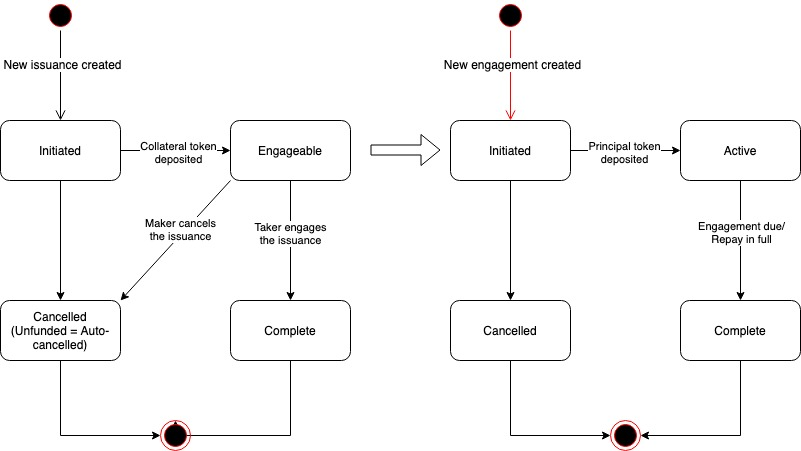

# Borrowing

The borrowing instrument allows makers to deposit collaterals, borrow digital assets and pay interest. Takers can deposit borrowing assets and expect interest as return.

Currently, the borrow instrument is 1 to 1 only, which means one borrowing issuance can be engaged by only one taker.

## Borrowing Lifecycle

The image below shows the lifecycle of borrowing issuance and engagement.

* When a borrowing issuance is created and the collateral token is deposited, the borrowing issuance becomes Engageable;
* When a taker engages the borrowing issuance, a borrowing engagement is created and the borrowing issuance becomes Complete with a completion ratio of 10000;
* When maker cancels an Engageable borrowing issuance, the borrowing issuance becomes Cancelled and the deposited collateral token is returned;
* When taker deposits the principal token, the engagement is Active and the principal token is transferred to maker;
* When the borrowing engagement is due or maker repays in full\(principal + interest\), the engagement becomes Complete. Borrowing issuance defines a borrowing-specific engagement property to determine whether it's Complete as it's due or repaid.

## Borrowing Parameters

The borrowing instrument is highly customizable. It defines a set of parameters which allows both Service providers and makers to customize the borrowing instrument and its issuances.

### Borrowing Service Provider Parameters

The following parameters allow Service Provider to customize the borrowing instrument. They are all defined in the borrowing instrument contract.

| Borrowing Instrument Parameter | Description | Default |
| :--- | :--- | :--- |
| Max issuance duration | Maximum life of the issuance in seconds | 14 days |
| Min issuance duration | Minimum life of the issuance in seconds | 0 |
| Max tenor days | Maximum life of the engagement in days | 90 |
| Min tenor days | Minimum life of the engagement in days | 2 |
| Max collateral ratio | Maximum collateral ratio with 4 decimals\(0.01%\) | 200% |
| Min collateral ratio | Minimum collateral ratio with 4 decimals\(0.01%\) | 50% |
| Max interest rate | Maximum interest rate with 6 decimals\(0.0001%\) | 5.0000% |
| Min interest rate | Minimum interest rate with 6 decimals\(0.0001%\) | 0.0010% |

### Borrowing Maker Parameters

The following parameters allow makers to customize the lending issuance. They are defined as the maker data in creating new lending issuance.

| Borrowing Issuance Parameters | Description |
| :--- | :--- |
| Issuance duration | The duration of issuance in seconds |
| Lending token address |  |
| Lending amount |  |
| Collateral token address |  |
| Collateral ratio | The ratio of collateral to principal |
| Tenor | The duration of engagement in seconds |
| Interest rate | The per day interest rate to pay in principal |

## Borrowing Custom Property

### Borrowing Issuance Custom Property

The borrowing issuance defines a set of custom property. It includes all the maker parameters shown in the previous section with the following additional fields:

* Collateral amount:  The actual collateral amount deposited. For borrowing engagement, the actual collateral value is computed at the time of issuance creation using the price oracle. Therefore, it's part of the borrowing issuance property.
* Interest amount: The computed interest amount to pay

### Borrowing Engagement Custom Property

The borrowing engagement also defines a set of custom properties.

* Loan state: The state of the loan. Could be Unpaid/Repaid/Delinquent. It's useful to identify whether a borrowing issuance is Complete because it's due or repaid.

