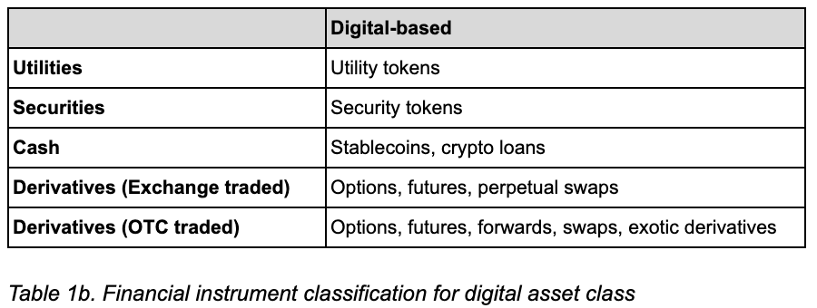

# Multiple Classes of Financial Instruments

In the context of traditional finance, financial instruments can be categorized according to an asset class; equity, debt or foreign exchange based. Table 1a outlines the different types of financial instruments for each asset class. 

Using a similar instrument classification system for digital assets \(shown in Table 1b.\), most DeFi protocols are designed for one specific class of financial instrument \(such as MakerDAO with DAI stablecoin, Compound with money market instrument\).

The motivation in enriching financial instrument diversity is to enable different forms of risk management strategies and asset differentiation mechanism through the use of instruments such as options, futures, forwards  swaps, lock-ups. 

Take lending instruments for example; it provided an alternative avenue for digital asset allocation, stimulating storage behaviour for quality assets and effectively differentiating from subpar quality assets.  

